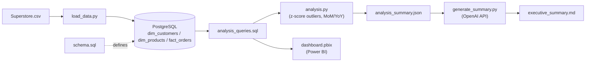

# Architecture

1. `load_data.py` reads `data/Superstore.csv` and loads it into the Postgres tables defined in `schema.sql`.
2. `analysis_queries.sql` runs SQL-side analytics (monthly sales, category/segment/region profit margins, top customers, discount-vs-profit, ...) directly against the database. These queries also feed the Power BI dashboard.
3. `analysis.py` pulls query results into Python, runs z-score outlier detection and MoM/YoY growth calculations, and writes `data/processed/analysis_summary.json`.
4. `generate_summary.py` sends that JSON summary to the OpenAI API and writes the result to `docs/executive_summary.md`.
